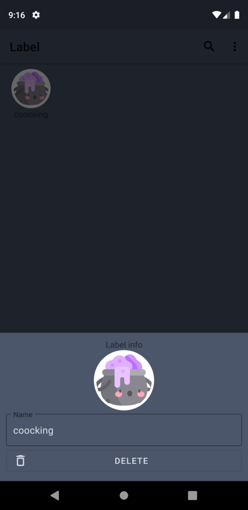
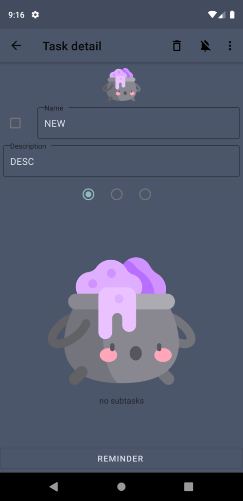
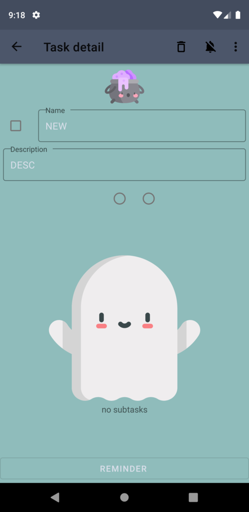
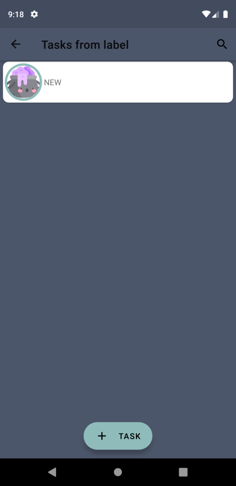
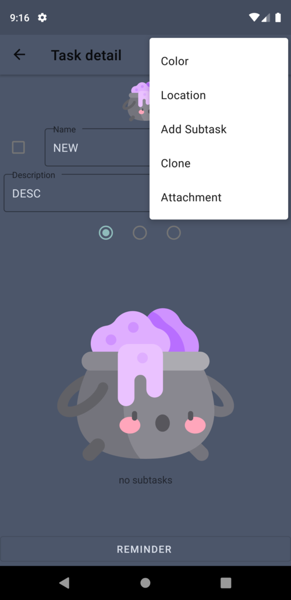
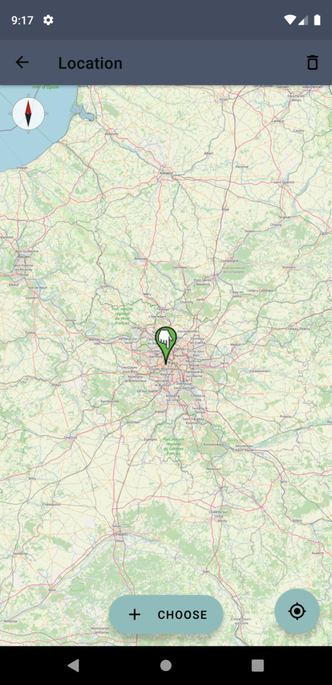
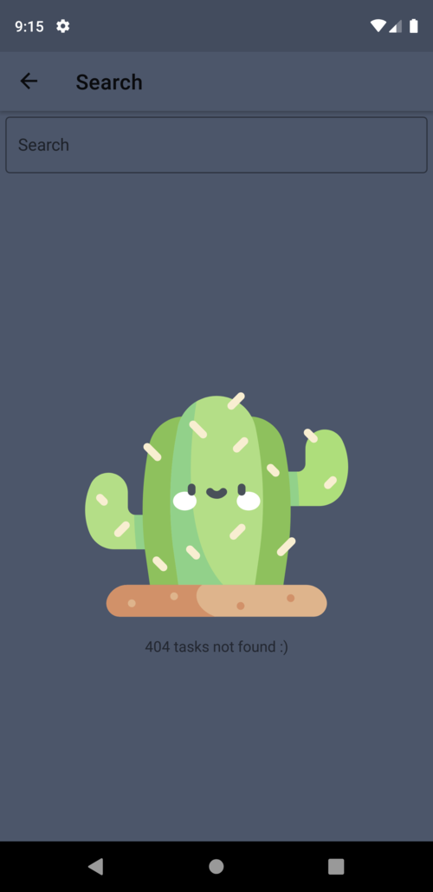

# TodoButler - Todo app
Todo app that helps you to keep focused on stuff that needs to be done

## Table of contents
* [General info](#general-info)
* [Features](#features)
* [Technologies](#technologies)
* [Setup](#setup)

## General info
The goal of the project was to develop a Todo App to organize tasks in labels. The UI is very minimal but with no compromise in features.

## Features
| Feature | Screenshot |
| ------------- | -----:|
| Bundle tasks with labels  |  |
| Task with sub tasks and reminder |  |
| Change color of a task |  |
| Change color of a task |  |
| Copy tasks, add attachments and pin as notification |  |
| Add a location |  |
| Search for tasks |  |

## Technologies
Project is created with:
* Kotlin
* RxKotlin / RxAndroid
* MVVM-Architecture
	
## Setup
To run this project, clone the repository with AndroidStudio or in the terminal:

```
$ git clone https://github.com/free-bots/TodoButler.git
```

